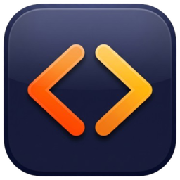
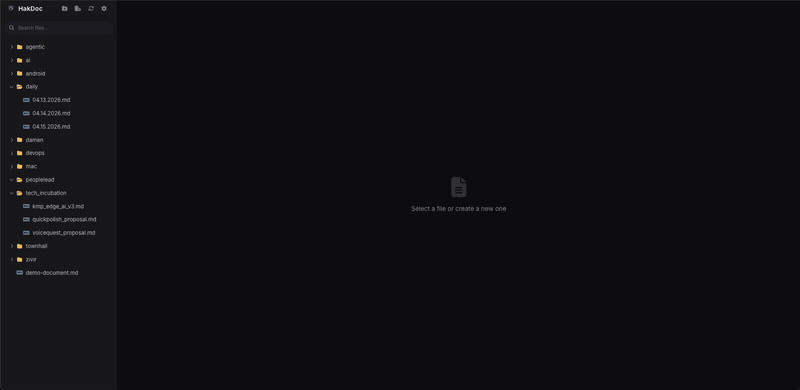
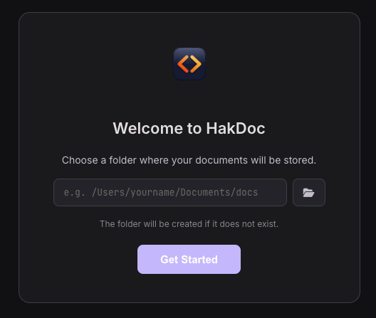
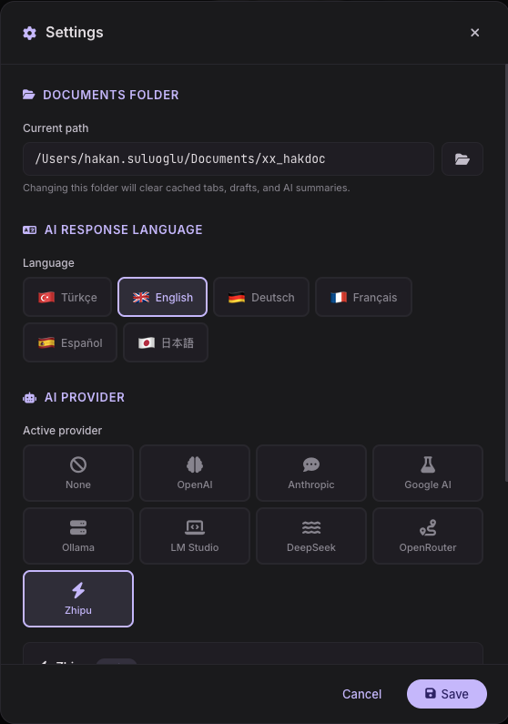

<p align="center">
  
</p>

<h1 align="center">HakDoc</h1>

<p align="center">
  <strong>Your docs, your machine, zero cloud.</strong><br>
  A native macOS app for browsing, editing, and summarizing Markdown &amp; PDF files — built for developers who live across multiple repos.
</p>

<p align="center">
  <a href="../../releases/latest"></a>&nbsp;
  &nbsp;
  
</p>

<p align="center">
  <a href="../../releases/latest">Download the latest release</a>
</p>

---

## The Problem

If you work with AI coding tools across multiple repositories, you know this cycle:

1. You generate `.md` files — context docs, architecture notes, prompt logs.
2. When the AI context fills up, you hand those docs to a new session.
3. Commit time arrives and those files are everywhere. They're not code, but you don't want to lose them either.
4. You add them to `.gitignore`, use global ignores, maybe even a `.dontcommit` folder — but with 5+ repos it's still a mess.
5. You end up symlinking everything into a single folder on your machine.

**Now you need a way to actually _read_ those files.** VS Code's Markdown preview is clunky for this. You want a fast, distraction-free viewer with a proper file tree — one that works on a single shared folder across all your projects.

That's why HakDoc exists.

---

## What It Does

<p align="center">
  
</p>

- **Browse a folder tree** — point HakDoc at any folder and instantly navigate your docs with a collapsible sidebar.
- **Render Markdown beautifully** — syntax-highlighted code blocks, Mermaid diagrams, tables, checklists — all rendered in a dark GitHub-style theme.
- **Edit in place** — format toolbar with headings, bold, italic, tables, code blocks, and more. Auto-save drafts mean you never lose work.
- **View PDFs** — no need to switch apps.
- **Multi-tab workflow** — open several files side by side, just like a browser.
- **Full-text search** — find anything across all your docs instantly.
- **Drag & drop** — move files around or drop new ones in from Finder.
- **AI Summary** — summarize any document with one click. Bring your own provider (OpenAI, Anthropic, Google, Ollama, and more).
- **Built-in Settings** — configure your docs folder and AI provider from within the app. No config files needed.
- **100% local** — your files stay on your machine. No accounts, no sync, no telemetry.

---

## Quick Start

### 1. Download & Install

1. Grab the `.dmg` from the **[Releases](../../releases/latest)** page.
2. Open it, drag **HakDoc** to Applications.
3. First launch: macOS may show a security warning — go to **System Settings → Privacy & Security → Open Anyway**.

> **Prerequisite:** [Node.js](https://nodejs.org) must be installed.
> Already using Homebrew? `brew install node` and you're set.

### 2. Pick Your Docs Folder

On first launch, HakDoc will ask you to choose a folder. This is where it reads your files from — pick your shared docs folder, a Notes directory, or anything you like. The folder will be created if it doesn't exist.

<p align="center">
  
</p>

You can change this anytime from **Settings** (gear icon in the sidebar).

### 3. (Optional) Enable AI Summaries

Open **Settings** from the gear icon in the sidebar, pick your AI provider, paste your API key, and hit Save. That's it — no config files to edit.

<p align="center">
  
</p>

8 providers are supported out of the box:

| Provider | What you need |
|---|---|
| **OpenAI** | API key |
| **Anthropic** | API key |
| **Google AI** | API key |
| **DeepSeek** | API key |
| **OpenRouter** | API key |
| **Zhipu / Z.AI** | API key |
| **Ollama** (local) | Just a running Ollama instance |
| **LM Studio** (local) | Just a running LM Studio server |

If no provider is configured, AI buttons stay hidden — nothing breaks.

<details>
<summary><strong>Prefer the command line?</strong></summary>

You can also configure everything via `~/.config/hakdoc/.env`:

```bash
mkdir -p ~/.config/hakdoc
```

```bash
# Pick one: openai | anthropic | google | ollama | deepseek | openrouter | lmstudio | zhipu
AI_PROVIDER=openai
OPENAI_API_KEY=sk-...

# Optional: override the default model
OPENAI_MODEL=gpt-4o

# Docs folder (also configurable from the app)
DOCS_ROOT=/Users/yourname/Documents/dev-docs
```

See `.env.example` for all available options per provider.

</details>

---

## Tips for Multi-Repo Workflows

HakDoc was built for developers juggling docs across multiple projects. Here's a workflow that works well:

1. **Create a shared docs folder** — e.g. `~/Documents/dev-docs`
2. **Point HakDoc at it** — set it as your docs root on first launch
3. **Symlink from each repo** — `ln -s ~/Documents/dev-docs .dontcommit/docs` in each project
4. **Add `.dontcommit` to your global gitignore** — `echo ".dontcommit" >> ~/.config/git/ignore`

Now every repo can read and write to the same folder, and HakDoc gives you a single place to browse everything.

---

## Keyboard Shortcuts

| Shortcut | Action |
|---|---|
| `Cmd + S` | Save current file |
| `Cmd + E` | Toggle edit mode |
| `Cmd + F` | Search files |
| `Cmd + W` | Close current tab |
| `Cmd + Shift + N` | New file |

---

## License

MIT

---

<p align="center">
  Built by <a href="https://github.com/hakansuluoglu">@hakansuluoglu</a>
</p>
