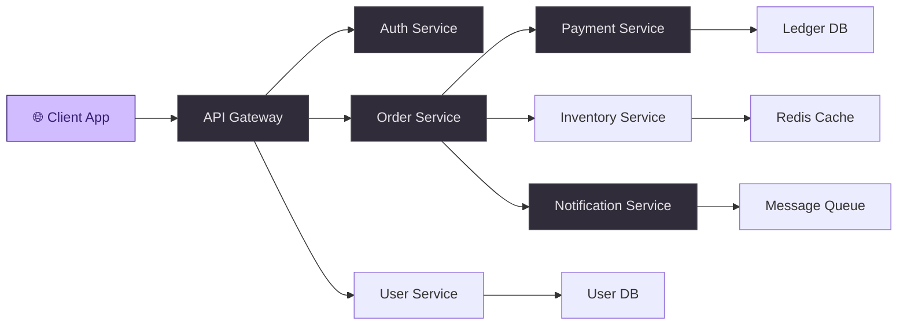
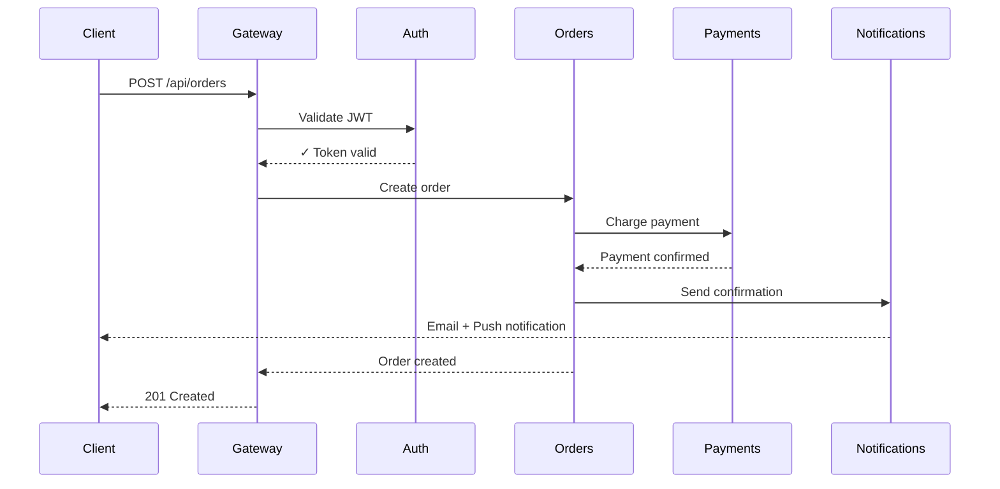
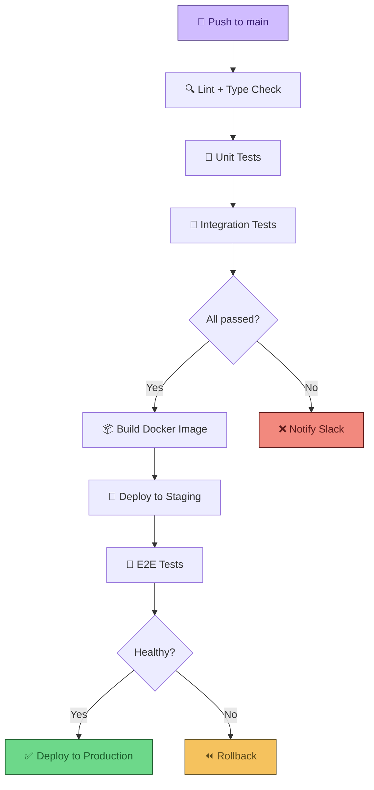

# Project Architecture — Microservices Overview

A high-level guide to our backend services, their responsibilities, and how they communicate.

> [!NOTE]
> This document is auto-generated from the architecture review on **2025-06-10**. Keep it updated as services evolve.

---

## Service Map



---

## Service Details

| Service | Port | Stack | Owner | Status |
|---------|------|-------|-------|--------|
| API Gateway | `8080` | Node.js + Express | Platform Team | ✅ Stable |
| Auth Service | `8081` | Go + JWT | Security Team | ✅ Stable |
| User Service | `8082` | Python + FastAPI | Backend Team | ✅ Stable |
| Order Service | `8083` | Node.js + NestJS | Commerce Team | ⚠️ Refactoring |
| Payment Service | `8084` | Java + Spring Boot | Payments Team | ✅ Stable |
| Inventory Service | `8085` | Rust + Actix | Backend Team | 🚧 Beta |
| Notification Service | `8086` | Go + gRPC | Platform Team | ✅ Stable |

---

## Request Flow



---

## Environment Config

```bash
# ─── Gateway ──────────────────────────────────────────
GATEWAY_PORT=8080
GATEWAY_RATE_LIMIT=1000/min
GATEWAY_CORS_ORIGINS=https://app.example.com

# ─── Auth ─────────────────────────────────────────────
AUTH_JWT_SECRET=your-secret-here
AUTH_TOKEN_EXPIRY=15m
AUTH_REFRESH_EXPIRY=7d

# ─── Database ────────────────────────────────────────
DB_HOST=localhost
DB_PORT=5432
DB_NAME=myapp
DB_POOL_SIZE=20
```

---

## Deployment Pipeline



---

## Key Metrics

- **p99 Latency:** Gateway → Response in under `120ms`
- **Uptime SLA:** `99.95%` across all services
- **Throughput:** ~`12,000` requests/sec at peak

> [!TIP]
> Run `./scripts/health-check.sh` to verify all services are responding. It hits every `/healthz` endpoint and reports status.

---

## Checklist — Before Going Live

- [x] All services pass health checks
- [x] JWT rotation configured
- [x] Rate limiting enabled on gateway
- [x] Database migrations applied
- [ ] Load testing with 10k concurrent users
- [ ] Disaster recovery drill
- [ ] Security audit sign-off

---

## Quick Reference

### Common Commands

```bash
# Start all services locally
docker compose up -d

# Run tests for a specific service
cd services/orders && npm test

# View real-time logs
docker compose logs -f gateway auth orders

# Check service health
curl -s localhost:8080/healthz | jq .
```

### API Examples

```javascript
// Create a new order
const response = await fetch('/api/orders', {
  method: 'POST',
  headers: {
    'Authorization': `Bearer ${token}`,
    'Content-Type': 'application/json',
  },
  body: JSON.stringify({
    items: [
      { sku: 'WIDGET-001', quantity: 2, price: 29.99 },
      { sku: 'GADGET-042', quantity: 1, price: 149.00 },
    ],
    shipping: 'express',
  }),
});

const order = await response.json();
console.log(`Order ${order.id} created — total: $${order.total}`);
```

> [!IMPORTANT]
> All API calls require a valid JWT in the `Authorization` header. Tokens expire after 15 minutes — use the refresh endpoint to rotate.

---

*Last updated: June 2025*
